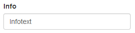
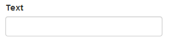
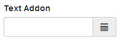
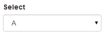
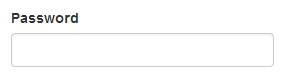
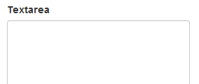
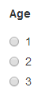
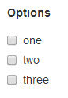

# Some Bootstrap Elements for Laravel

This package provides some form elements for Laravel 4 + Bootstrap 3.

  * shows first error message in help text
  * automatically repopulates the form elements

There is a demo page included in this package: use ``View::make('bselements::demopage')``.

## Example

````php
{{ BsForm::useMessageBag($errors) }}
{{ BsForm::info('Info', 'Infotext', array()) }}
{{ BsForm::text('text', 'Text') }}
{{ BsForm::textAddon('left', 'Demo', 'textaddon1', 'Text-Addon') }}
{{ BsForm::textAddon('right', 'Demo', 'textaddon2', 'Text-Addon') }}
{{ BsForm::password('password', 'Password') }}
{{ BsForm::select('select', 'Select', array(''=>'-- Choose --','s1'=>'Select 1','s2'=>'Select 2','s3'=>'Select 3')) }}
{{ BsForm::textarea('textarea', 'Textarea') }}
{{ BsForm::radioGroup('radiogroup', 'radioGroup', array('r1'=>'1','r2'=>'2','r3'=>'3')) }}
{{ BsForm::checkboxGroup('checkboxGroup', array('c1'=>'one','c2'=>'two','c3'=>'three')) }}
````

## Usage

First register the service provider ``Alexwenzel\Bselements\BselementsServiceProvider`` in ``app/conf/app.php``.

Then you can use it with the following syntax:

`````php
{{ BsForm::text('text', 'Text') }}
````

## Form elements

### Injecting validation messages

You can inject your validation messages within you template into the BsForm class.

````php
BsForm::useMessageBag($errors)
````

### Info

Generates a text input look-alike field, without any functionality.

````php
BsForm::info($label, $text, array $attributes = array())
````



### Text

Generates a text input element.

````php
BsForm::text($id, $label, array $attributes = array())
````



### Text Addon

Generates a text input element with addon.

````php
BsForm::textAddon($addonDirection, $addonContent, $id, $label, array $attributes = array())
````

  * ``$addonDirection`` can be ``left`` or ``right``
  * ``$addonContent`` can be any HTML/String



### Select

Generates a select element.

````php
BsForm::select($id, $label, array $elements, array $attributes = array())
````



### Password

Generates a password input element.

````php
BsForm::password($id, $label, array $attributes = array())
````



### Textarea

Generates a textarea element.

````php
BsForm::textarea($id, $label, array $attributes = array())
````



### Radio Group

Generates a group of radio elements.

````php
BsForm::radioGroup($id, $label, array $values)
````



### Checkbox Group

Generates a group of checkbox elements.

````php
BsForm::checkboxGroup($label, array $values)
````

